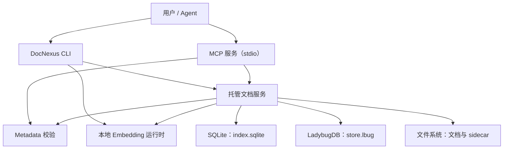
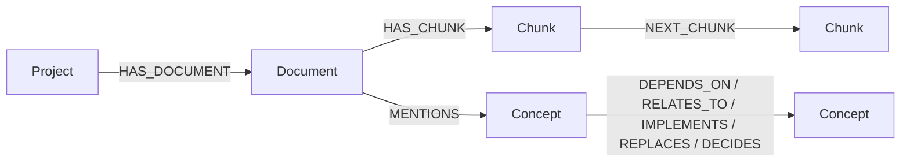
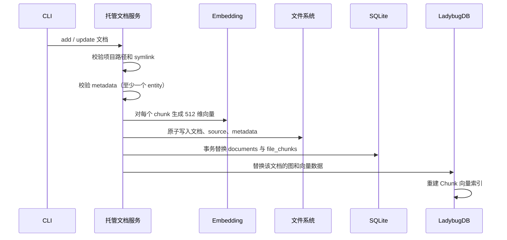
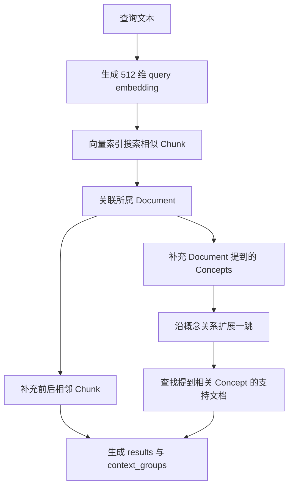

# DocNexus 当前架构

本文描述 DocNexus 当前代码已经实现的整体架构、数据边界和主要执行流程。历史方案与阶段性设计保留在 [`docs/history/`](../history/README.md)，本文以当前源码行为为准。

## 1. 系统定位

DocNexus 是一个面向本地项目的文档记忆与 Graph RAG 工具。它将项目文档同时组织为：

- 文件系统中的可读文档与完整 metadata；
- SQLite 中的托管文档账本和 chunk 索引；
- LadybugDB 中的向量、概念和图关系；
- 供用户直接操作的 CLI；
- 供 Agent 查询项目状态和文档的 MCP 服务。

所有数据默认保存在项目根目录下的 `.docnexus/`，不同项目之间通过显式项目根路径隔离。

## 2. 组件关系



主要代码入口：

- CLI：[`src/cli.ts`](../../src/cli.ts)
- MCP：[`src/mcp.ts`](../../src/mcp.ts)
- 托管文档：[`src/managed-documents.ts`](../../src/managed-documents.ts)
- Metadata 校验：[`src/metadata.ts`](../../src/metadata.ts)
- Embedding：[`src/embedder-real.ts`](../../src/embedder-real.ts)
- 图存储与召回：[`src/ladybug-store.ts`](../../src/ladybug-store.ts)
- 召回输出校验：[`src/recall.ts`](../../src/recall.ts)

## 3. 数据存储分工

### 3.1 文件系统

文件系统保存完整且便于人工查看的数据：

```text
<project>/
├── <managed-document-path>       # 生成后的完整文档
└── .docnexus/
    ├── project.json              # 项目初始化信息
    ├── index.sqlite              # 托管文档与 chunk 账本
    ├── store.lbug                # LadybugDB 图和向量数据
    ├── documents/<document-id>/
    │   ├── source.md             # 原始输入
    │   └── metadata.json         # 完整 metadata
    └── schemas/
        └── metadata.schema.json
```

托管路径必须位于项目内，并且路径中的既有组件不得是符号链接。写入、删除和 reset 会同时进行词法路径与真实路径校验，防止通过 symlink 访问项目外文件。

### 3.2 SQLite

SQLite 位于 `.docnexus/index.sqlite`，作为管理账本和可恢复的 chunk 数据源。

#### `documents`

| 字段 | 含义 |
| --- | --- |
| `id` | 文档稳定 ID |
| `file_path` | 项目内托管文档路径 |
| `title`、`summary` | 文档基础 metadata |
| `tags_json` | 标签数组 |
| `source_hash` | 原始输入哈希 |
| `document_hash` | 生成文档哈希，用于检测外部修改 |
| `metadata_hash` | 完整 metadata 哈希 |
| `created_at`、`updated_at` | 创建与更新时间 |
| `sidecar_path` | `source.md` 和 `metadata.json` 所在目录 |

#### `file_chunks`

| 字段 | 含义 |
| --- | --- |
| `id` | chunk 稳定 ID |
| `document_id` | 所属文档 ID |
| `chunk_index` | chunk 在文档中的顺序 |
| `text` | chunk 完整文本 |
| `text_hash` | chunk 文本哈希 |
| `embedding_json` | 512 维 embedding 的 JSON 表示 |
| `created_at` | 创建时间 |

`file_chunks.document_id` 通过外键关联 `documents.id`，删除文档时级联删除其 chunks。

### 3.3 LadybugDB

LadybugDB 位于 `.docnexus/store.lbug`，是嵌入式属性图数据库，不依赖独立数据库服务。DocNexus 在每次操作中打开本地数据库、执行 Cypher 查询并关闭连接。

节点模型：

| 节点 | 主要属性 |
| --- | --- |
| `Project` | `id`、`name`、`root_path` |
| `Document` | `id`、`title`、`path`、`summary`、`content_hash`、`updated_at` |
| `Chunk` | `id`、`document_id`、`text`、`text_hash`、`chunk_index`、512 维 `embedding` |
| `Concept` | `id`、`name`、`type`、`description` |

关系模型：



`Concept` ID 根据规范化后的“实体类型 + 实体名称”生成。写入时使用 `MERGE`，因此不同文档可以共享同一 Concept。Document 和 Chunk 属于具体文档，在文档更新时整体替换。

当前关系的 `description` 保存在完整 `metadata.json` 中，但尚未作为 LadybugDB 边属性落库。

## 4. 文档写入流程



写入前会保存当前状态快照。如果文件、SQLite 或图写入失败，托管文档服务会尝试恢复此前状态。该机制提供应用层补偿，但目前还不是跨文件系统、SQLite 和 LadybugDB 的单一原子事务。

LadybugDB 中的更新采用整文档替换：

1. 删除旧 Document、旧 Chunks 及其关联边；
2. `MERGE` Project；
3. 创建新的 Document 和 Chunks；
4. 创建 `HAS_DOCUMENT`、`HAS_CHUNK` 和 `NEXT_CHUNK`；
5. `MERGE` Concepts，并创建 `MENTIONS` 和概念关系；
6. 重新建立 Chunk 向量索引。

删除文档不会自动删除共享 Concept。图维护流程负责识别并清理不再被任何文档引用的孤立 Concept。

## 5. 召回流程

召回由 CLI 发起，当前尚未注册为 MCP 工具。



### 5.1 向量入口

LadybugDB 在 `Chunk.embedding` 上建立余弦距离索引：

```cypher
CALL CREATE_VECTOR_INDEX(
  'Chunk',
  'chunk_vector_index',
  'embedding',
  metric := 'cosine'
)
```

查询时调用：

```cypher
CALL QUERY_VECTOR_INDEX(
  'Chunk',
  'chunk_vector_index',
  $query_embedding,
  $limit
)
```

LadybugDB 返回距离，DocNexus 将其转换为相似度：`score = 1 - distance`。

### 5.2 上下文扩展

获得首批相似 chunks 后，系统继续补充：

- 命中 chunk 的前一个和后一个 chunk；
- 所属文档的标题、摘要和路径；
- 文档 `MENTIONS` 的 Concepts；
- Concept 的一跳关系路径；
- 提到相关 Concept 的其他文档 chunks。

因此当前召回策略可以概括为：

```text
向量相似度确定入口
+ 相邻 chunk 恢复局部语境
+ 一跳图关系补充语义
+ 关联文档提供支持证据
```

## 6. MCP 服务边界

MCP 通过 stdio 对外提供全局服务。每次调用都必须传入绝对路径 `project_root`，服务会验证该路径对应一个已初始化的 DocNexus 项目，然后再路由到托管文档层。

当前注册工具：

| 工具 | 能力 |
| --- | --- |
| `list_records` | 列出文档摘要，支持标签和数量限制 |
| `get_record` | 按 ID 获取 source、document 或 metadata |
| `status` | 查询项目初始化状态、存储路径和文档数 |
| `index_status` | 查询文档数和 chunk 数 |
| `validate_metadata` | 在写入前校验 metadata |

MCP 当前是只读查询与校验网关，不执行以下操作：

- 文档 add、delete；
- reset、rebuild；
- embedding 生成；
- 图数据库写入；
- recall 召回。

这些写操作和召回能力目前由 CLI 调用。

## 7. 一致性与数据权威边界

| 数据 | 主要保存位置 | 用途 |
| --- | --- | --- |
| 原始输入 | `source.md` | 重建和审计 |
| 完整生成文档 | 项目目标路径 | 用户和工具直接读取 |
| 完整 metadata | `metadata.json` | entities、relationships 和描述的完整记录 |
| 文档管理状态 | SQLite `documents` | 清单、哈希、路径和更新时间 |
| chunk 与向量副本 | SQLite `file_chunks` | 管理、恢复和重建 |
| 图与检索向量 | LadybugDB | 实际 Graph RAG 召回 |

Chunk 文本和 embedding 当前同时写入 SQLite 与 LadybugDB。这是有意的数据冗余：SQLite 作为管理与恢复账本，LadybugDB 作为在线召回执行层。

## 8. 当前限制与后续关注点

- 每次文档图更新都会删除并重建向量索引，数据规模扩大后会影响写入性能；
- 文件系统、SQLite 和 LadybugDB 之间依赖补偿恢复，尚无真正的跨存储原子提交；
- 图扩展固定为一跳，尚未加入多跳深度、边权重或路径评分；
- relationship description 尚未保存为图边属性；
- MCP 尚未开放 recall，因此 Agent 不能通过 MCP 直接执行 Graph RAG 召回；
- 缺少针对大规模文档集的检索质量与延迟基准。

这些限制属于后续演进方向，不影响当前本地文档管理和基础 Graph RAG 流程。
