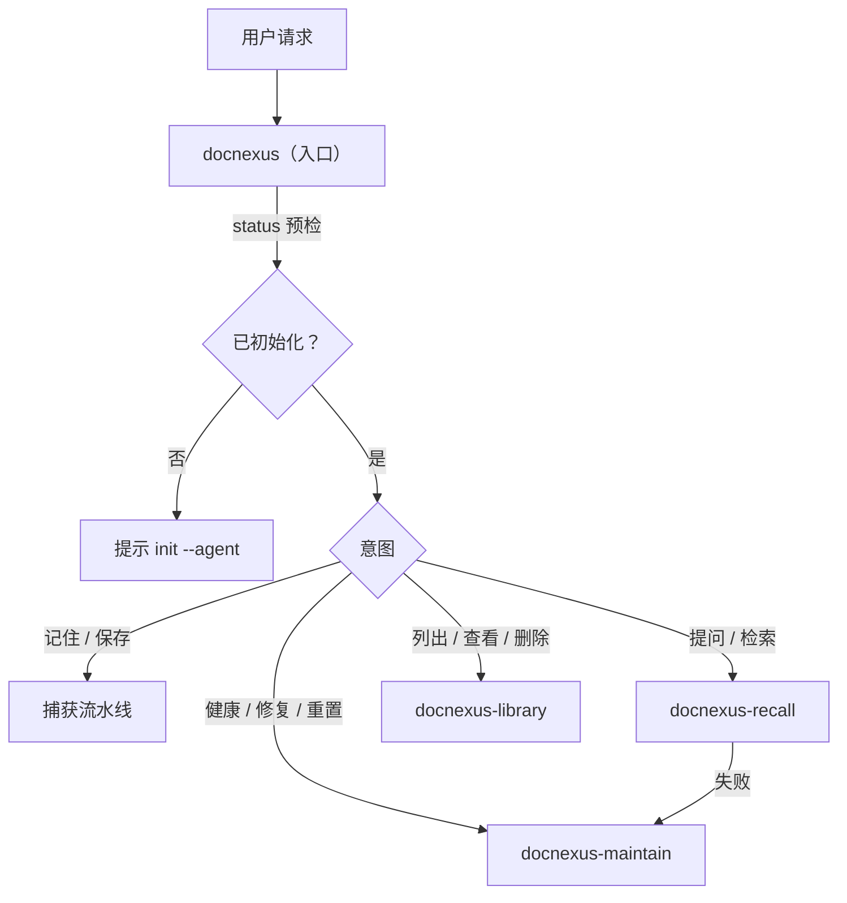
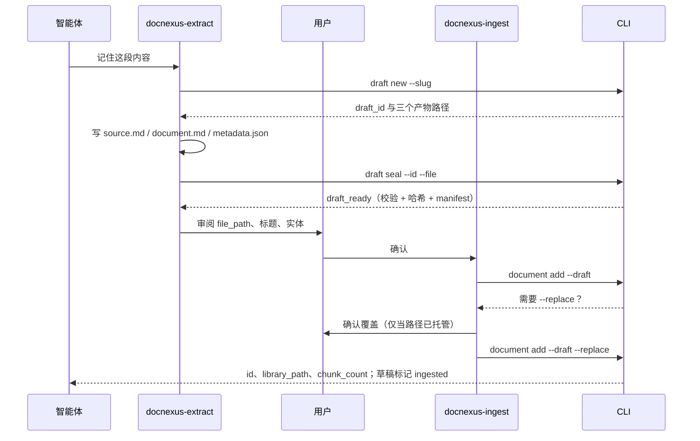
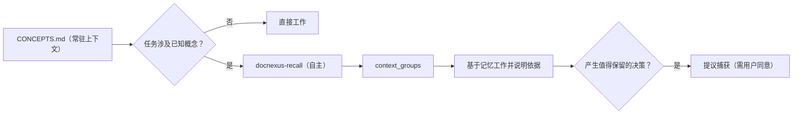

# Skills 工作区与功能编排

本文说明 DocNexus 的 skills 工作区设计：以 skills 为唯一交互入口，项目初始化后建立可见的 `docnexus/` 工作区，skills、草稿、产出文档、文本记录与派生数据全部收拢在该目录下。0.5.0 起文本记录是唯一真源，`store/` 可随时重建；智能体加载概念索引并自主召回。旧版本项目不做兼容。

## 1. 工作区布局

```text
<project>/
  node_modules/@rowansenne/docnexus/   # CLI 与随包模型（执行引擎）
  docnexus/                            # DocNexus 拥有的全部内容
    project.json                       # 格式标记（format_version 5）
    README.md                          # 工作区说明
    .gitignore                         # 忽略 store/
    CONCEPTS.md                        # 自动生成的概念索引
    skills/                            # 项目 skills，带包版本戳 .docnexus-skills.json
      docnexus/                        # 入口编排 skill
      docnexus-extract/
      docnexus-ingest/
      docnexus-recall/
      docnexus-library/
      docnexus-maintain/
    drafts/<draft_id>/                 # 提炼草稿：source.md、document.md、metadata.json、manifest.json
    library/<file_path>.md             # 托管文档（面向人的产出，可手动编辑）
    records/<document_id>/             # 文本真源
      source.md                        # 原始输入
      metadata.json                    # 实体、关系、标题、摘要、标签
      record.json                      # id、file_path、时间戳与三份内容的哈希
    schemas/metadata.schema.json
    store/                             # 派生状态，只由 CLI 读写，可删除后重建
      index.sqlite                     # 文档与 chunk 账本
      graph.lbug                       # LadybugDB 图谱与向量
      models/                          # 可选的项目模型覆盖
  .claude/skills/docnexus* -> ../../docnexus/skills/docnexus*   # --agent claude
  CLAUDE.md                            # --agent claude：DocNexus 区块，@docnexus/CONCEPTS.md
  .agents/skills/docnexus* -> ../../docnexus/skills/docnexus*   # --agent codex
  AGENTS.md                            # --agent codex：DocNexus 区块
```

分层原则：

| 目录 | 谁写入 | 用途 |
| --- | --- | --- |
| `skills/` | `init`、`skills sync`、版本不一致时自动刷新 | 智能体行为定义 |
| `drafts/` | 智能体（仅限 `draft new` 分配的目录） | 待审阅、待入库的提炼结果 |
| `library/` | CLI；用户可手动编辑，经 `document sync` 采纳 | 可读、可召回的当前文档 |
| `records/` | CLI | 文本真源，可提交到 Git |
| `CONCEPTS.md` | CLI（每次变更后重新生成） | 智能体加载的概念索引 |
| `store/` | CLI | 由 `records/` + `library/` 重建的索引、图谱、向量 |

智能体客户端只会扫描 `.claude/skills/` 或 `.agents/skills/`，因此 `skills link`（或 `init --agent`）在其中创建指向 `docnexus/skills/` 的目录链接（Windows 使用 junction），并在 `CLAUDE.md` / `AGENTS.md` 中写入 `<!-- docnexus:start -->` … `<!-- docnexus:end -->` 区块。这两类是工作区之外仅有的 DocNexus 内容；`reset` 只删除指向本工作区的链接和该区块，区块外的内容保持不变。

## 2. 功能编排

### 2.1 Skills 分工

| Skill | 职责 | 调用的 CLI |
| --- | --- | --- |
| `docnexus` | 入口：预检、意图路由、串联捕获流水线、统一安全规则 | `status` |
| `docnexus-extract` | 提炼原始内容，写入草稿并封存 | `draft new`、`metadata validate`、`draft seal` |
| `docnexus-ingest` | 把已封存草稿写入 library 并建立索引 | `draft list`、`document add --draft` |
| `docnexus-recall` | 主动或按需的 Graph RAG 召回，并据此工作或回答 | `recall`、`concepts` |
| `docnexus-library` | 浏览概念与文档、采纳手动编辑、删除文档；查看与丢弃草稿 | `concepts`、`document list/get/sync/delete`、`draft list/discard` |
| `docnexus-maintain` | 诊断、同步、修复、重建、重置 | `doctor`、`index`、`graph`、`skills`、`embeddings`、`reset` |

### 2.2 路由



### 2.3 捕获流水线



编排要点：

- **CLI 保证契约，skill 只做判断。** 草稿 ID 分配、产物非空、metadata 校验、manifest 生成、封存后篡改检测都由 CLI 完成；skill 不再手写 manifest 或逐文件回读。
- **一个阶段一个交接物。** extract 交出 `draft_id`；ingest 只接受 `ready` 状态的草稿；成功后草稿变为 `ingested`，不能重复入库。
- **确认点集中。** `--replace`、`document delete`、`draft discard`、`index rebuild`、`graph repair`、`reset` 都要求本次对话中的明确确认，`--force` 仅记录已完成的确认。
- **失败即停。** 任一阶段失败，入口 skill 报告失败阶段，不跳过或回退到其他入口。

### 2.4 草稿状态

| 状态 | 含义 | 下一步 |
| --- | --- | --- |
| `open` | 已分配目录，尚未封存 | 写完产物后 `draft seal` |
| `ready` | 已校验并记录哈希 | `document add --draft` |
| `ingested` | 已写入 library | 可 `draft discard` 清理 |
| `invalid` | manifest 无法解析 | 重新封存或丢弃 |

封存后修改任一产物，`document add` 会拒绝并要求重新封存。

## 3. 自主召回与概念加载

目标：智能体在工作中自己判断何时需要项目记忆，而不是等用户指挥。

1. **概念索引常驻上下文。** 每次入库、同步、删除、重建后，CLI 由 `records/*/metadata.json` 汇总实体（按类型、名称合并）生成 `CONCEPTS.md`：名称、一句话描述、关系、定义它的文档。Claude 通过 `CLAUDE.md` 中的 `@docnexus/CONCEPTS.md` 导入自动加载；Codex 按 `AGENTS.md` 指引在任务开始时读取。条目超过 300 个时截断，可用 `docnexus concepts --query/--type` 按需查询。
2. **召回由 skill 描述触发。** `docnexus-recall` 的 description 声明"主动使用"：任务涉及索引中的概念、既有决策、组件或约定时，智能体直接召回；琐碎改动、通用问题、本对话已召回的话题则跳过；每个任务最多三次。
3. **查询以概念为锚。** 查询词优先使用 `CONCEPTS.md` 中的原名（图谱节点即由这些名称生成），再加上要了解的内容。提炼时也要求复用已有概念名，保证不同文档在图谱中相连。
4. **透明且只读。** 自主召回后，智能体用一句话说明依据的文档；记忆与代码冲突时指出冲突。召回不写任何数据；记录新知识仍需用户同意。



## 4. Git 同步与手动编辑

- `records/<id>/record.json` 保存 id、`file_path`、创建/更新时间与 source、document、metadata 三份哈希，是文档身份的唯一来源。SQLite 与 LadybugDB 都由它重建，因此 `store/` 默认写入 `docnexus/.gitignore`。
- `index sync`：对比 `records/` 与 SQLite，索引新增或哈希变化的记录，删除记录已不存在的索引项。它只动派生数据，skills 可以不经确认运行；`recall` 发现不同步时会自动执行。
- `index rebuild --force`：重新嵌入全部记录（例如更换模型或项目路径变化）。内容未变时 `record.json` 保持不变，重建不会产生 Git 差异。
- 手动编辑：`library/` 文件与 `record.json` 中的 document 哈希不一致时，`status` / `doctor` 将其列为 `edited`。`index sync` 不会覆盖它；`document sync --id <id> [--metadata-file <path>]` 经用户确认后采纳编辑，保留原 `source.md`，可同时更新 metadata。
- 拉取到别人对同一文档的修改时，record 与 library 一起更新，`index sync` 按新哈希重建；若本地也手动改过 library，则会报告为 `edited`，由用户决定采纳还是用 Git 解决冲突。

## 5. 生命周期命令

```bash
./node_modules/.bin/docnexus init --agent claude     # 创建工作区、同步 skills、链接并写入 CLAUDE.md 区块
./node_modules/.bin/docnexus skills sync             # 手动刷新 docnexus/skills（版本不一致时也会自动执行）
./node_modules/.bin/docnexus skills link --target all
./node_modules/.bin/docnexus index sync              # 克隆或 git pull 后重建 store/
./node_modules/.bin/docnexus reset --force           # 删除整个 docnexus/、链接与指令区块
```

`init` 可重复执行：已初始化项目（包括刚克隆、没有 `store/` 的项目）只重建空目录与 SQLite 表、刷新 skills、链接和 `CONCEPTS.md`，不触碰数据。skills 同步时写入包版本戳；之后任一需要初始化的命令发现版本不一致，会自动刷新并在 stderr 提示。若项目中已有无标记的 `docnexus/` 目录，`init` 与 `reset` 都会拒绝操作，避免覆盖用户自己的同名目录。

## 6. 破坏性变更与升级

0.5.0（格式版本 5）：

- sidecars 由 `store/documents/<id>/` 移到 `records/<id>/`，并新增 `record.json`；`store/` 成为纯派生数据并默认 git-ignore。
- `index rebuild --force` 改为从文本记录重建；新增 `index sync`、`document sync`、`concepts` 和 `CONCEPTS.md`。
- `skills link` / `init --agent` 会修改 `CLAUDE.md` 或 `AGENTS.md` 中的 DocNexus 区块；`reset` 会清理该区块。
- `docnexus-recall` 由"仅用户明确要求"改为主动触发。

0.4.0（格式版本 4）：

- 数据目录由 `.docnexus/` 改为 `docnexus/`；托管文档由 `.docnexus/<file_path>` 移至 `docnexus/library/<file_path>`，图谱文件改名为 `store/graph.lbug`。
- `skills install` 移除，改为 `init` 自动同步加 `skills link` 链接；skills 重组为 6 个（见 2.1）。
- `document add` 只接受 `--draft <draft_id>`，不再接受 `--file/--source-file/--document-file/--metadata-file`。
- `reset` 删除整个 `docnexus/` 工作区；不再逐个校验托管文件。

旧项目不迁移。升级步骤：

1. 如需保留内容，先用旧版 `docnexus document get --include source,document,metadata` 导出。
2. 旧版为 0.4.x 时执行 `docnexus reset --force`；更早版本删除 `.docnexus/` 以及 `.agents/skills`、`.claude/skills` 下旧的 `docnexus-*` 目录。
3. 安装新版本并执行 `./node_modules/.bin/docnexus init --agent claude`（或 `codex`）。
4. 通过 `docnexus` skill 重新捕获需要的内容。

## 7. 取舍

- `docnexus/` 可见，便于人工浏览 `library/`、审阅 `drafts/`，并随代码提交。`store/` 不提交，另一台机器首次召回时需要重新嵌入全部文档，耗时与文档量成正比。
- `drafts/` 默认也会被提交；不希望提交草稿时，可在 `docnexus/.gitignore` 中追加 `drafts/`。
- 主动召回会增加少量上下文与耗时；由 skill 中的触发条件和每任务上限控制。`CONCEPTS.md` 常驻上下文，概念很多时截断到 300 条。
- 链接依赖文件系统对符号链接/junction 的支持；不支持时智能体仍可直接读取 `docnexus/skills/docnexus/SKILL.md`。
- 项目移动到新路径后，执行 `index rebuild --force` 刷新 LadybugDB 中的 Project 根路径。
