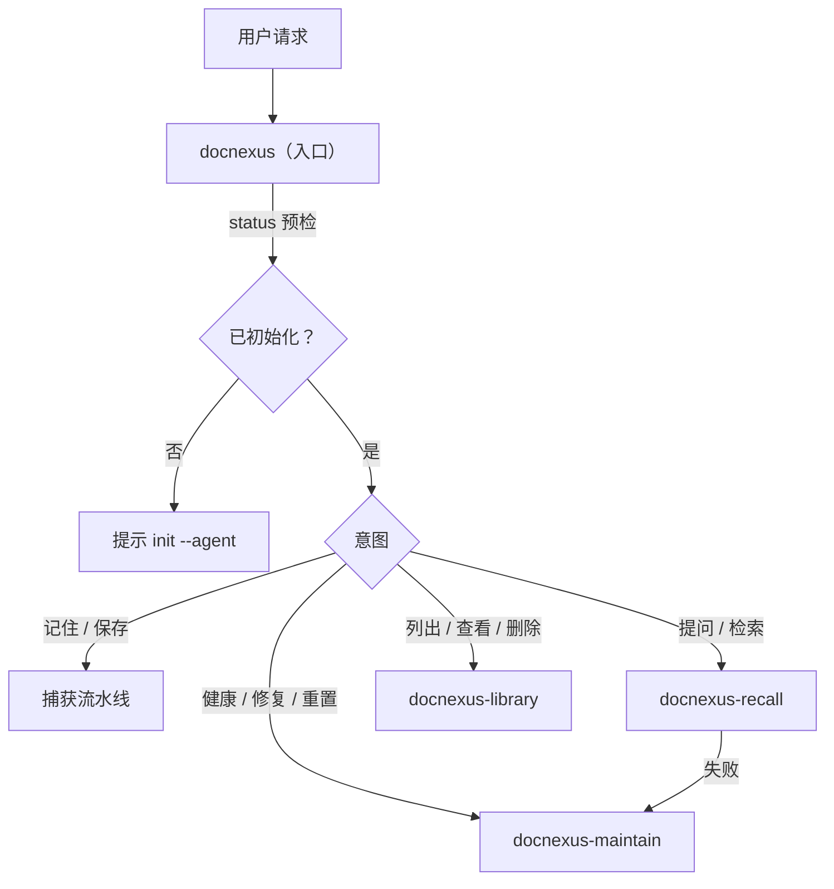
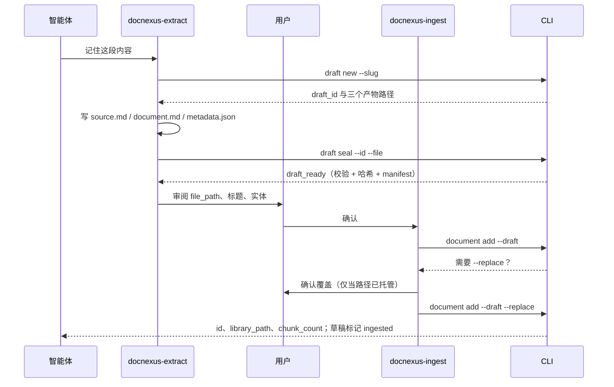

# Skills 工作区与功能编排

本文说明 0.4.0 的破坏性调整：DocNexus 以 skills 为唯一交互入口，项目初始化后建立可见的 `docnexus/` 工作区，skills、草稿、产出文档与派生数据全部收拢在该目录下。旧版 `.docnexus/` 与 `.agents/skills`、`.claude/skills` 中的复制式安装不做兼容。

## 1. 工作区布局

```text
<project>/
  node_modules/@rowansenne/docnexus/   # CLI 与随包模型（执行引擎）
  docnexus/                            # DocNexus 拥有的全部内容
    project.json                       # 格式标记（format_version 4）
    README.md                          # 工作区说明
    skills/                            # 项目 skills（唯一真源）
      docnexus/                        # 入口编排 skill
      docnexus-extract/
      docnexus-ingest/
      docnexus-recall/
      docnexus-library/
      docnexus-maintain/
    drafts/<draft_id>/                 # 提炼草稿：source.md、document.md、metadata.json、manifest.json
    library/<file_path>.md             # 托管文档（面向人的产出）
    schemas/metadata.schema.json
    store/                             # 派生状态，只由 CLI 读写
      index.sqlite                     # 文档与 chunk 账本
      graph.lbug                       # LadybugDB 图谱与向量
      documents/<document_id>/         # 当前 source 与 metadata sidecars
      models/                          # 可选的项目模型覆盖
  .claude/skills/docnexus* -> ../../docnexus/skills/docnexus*   # 可选链接
  .agents/skills/docnexus* -> ../../docnexus/skills/docnexus*   # 可选链接
```

分层原则：

| 目录 | 谁写入 | 用途 |
| --- | --- | --- |
| `skills/` | `init`、`skills sync` | 智能体行为定义，随包版本刷新 |
| `drafts/` | 智能体（仅限 `draft new` 分配的目录） | 待审阅、待入库的提炼结果 |
| `library/` | CLI | 可读、可召回的当前文档 |
| `store/` | CLI | 可由 library + sidecars 重建的索引、图谱、向量 |

智能体客户端只会扫描 `.claude/skills/` 或 `.agents/skills/`，因此 `skills link` 在其中创建指向 `docnexus/skills/` 的目录链接（Windows 使用 junction）。链接是工作区之外唯一的 DocNexus 条目；`reset` 只删除指向本工作区的链接。

## 2. 功能编排

### 2.1 Skills 分工

| Skill | 职责 | 调用的 CLI |
| --- | --- | --- |
| `docnexus` | 入口：预检、意图路由、串联捕获流水线、统一安全规则 | `status` |
| `docnexus-extract` | 提炼原始内容，写入草稿并封存 | `draft new`、`metadata validate`、`draft seal` |
| `docnexus-ingest` | 把已封存草稿写入 library 并建立索引 | `draft list`、`document add --draft` |
| `docnexus-recall` | Graph RAG 召回并据此回答 | `recall` |
| `docnexus-library` | 浏览、查看、删除文档；查看与丢弃草稿 | `document list/get/delete`、`draft list/discard` |
| `docnexus-maintain` | 诊断、修复、重建、重置 | `doctor`、`index`、`graph`、`skills`、`embeddings`、`reset` |

### 2.2 路由



### 2.3 捕获流水线



编排要点：

- **CLI 保证契约，skill 只做判断。** 草稿 ID 分配、产物非空、metadata 校验、manifest 生成、封存后篡改检测都由 CLI 完成；skill 不再手写 manifest 或逐文件回读。
- **一个阶段一个交接物。** extract 交出 `draft_id`；ingest 只接受 `ready` 状态的草稿；成功后草稿变为 `ingested`，不能重复入库。
- **确认点集中。** `--replace`、`document delete`、`draft discard`、`index rebuild`、`graph repair`、`reset` 都要求本次对话中的明确确认，`--force` 仅记录已完成的确认。
- **失败即停。** 任一阶段失败，入口 skill 报告失败阶段，不跳过或回退到其他入口。

### 2.4 草稿状态

| 状态 | 含义 | 下一步 |
| --- | --- | --- |
| `open` | 已分配目录，尚未封存 | 写完产物后 `draft seal` |
| `ready` | 已校验并记录哈希 | `document add --draft` |
| `ingested` | 已写入 library | 可 `draft discard` 清理 |
| `invalid` | manifest 无法解析 | 重新封存或丢弃 |

封存后修改任一产物，`document add` 会拒绝并要求重新封存。

## 3. 生命周期命令

```bash
./node_modules/.bin/docnexus init --agent claude     # 创建工作区、同步 skills、链接到 .claude/skills
./node_modules/.bin/docnexus skills sync             # 升级 npm 包后刷新 docnexus/skills
./node_modules/.bin/docnexus skills link --target all
./node_modules/.bin/docnexus reset --force           # 删除整个 docnexus/ 与指向它的链接
```

`init` 可重复执行：已初始化项目只刷新 skills 和链接，不触碰数据。若项目中已有无标记的 `docnexus/` 目录，`init` 与 `reset` 都会拒绝操作，避免覆盖用户自己的同名目录。

## 4. 破坏性变更与升级

- 数据目录由 `.docnexus/` 改为 `docnexus/`，格式版本升至 4；托管文档由 `.docnexus/<file_path>` 移至 `docnexus/library/<file_path>`，图谱文件改名为 `store/graph.lbug`。
- `skills install` 移除，改为 `init` 自动同步加 `skills link` 链接；skills 重组为 6 个（见 2.1）。
- `document add` 只接受 `--draft <draft_id>`，不再接受 `--file/--source-file/--document-file/--metadata-file`。
- `reset` 删除整个 `docnexus/` 工作区；不再逐个校验托管文件。

旧项目不迁移。升级步骤：

1. 如需保留内容，先用旧版 `docnexus document get --include source,document,metadata` 导出。
2. 删除 `.docnexus/` 以及 `.agents/skills`、`.claude/skills` 下旧的 `docnexus-*` 目录。
3. 安装新版本并执行 `./node_modules/.bin/docnexus init --agent claude`（或 `codex`）。
4. 通过 `docnexus` skill 重新捕获需要的内容。

## 5. 取舍

- `docnexus/` 可见，便于人工浏览 `library/` 与审阅 `drafts/`；是否提交到 Git 由项目决定。`store/` 为二进制派生数据，通常不提交；仅提交 `library/` 无法在另一台机器上直接召回，需要连同 `store/` 备份。
- 链接依赖文件系统对符号链接/junction 的支持；不支持时智能体仍可直接读取 `docnexus/skills/docnexus/SKILL.md`。
- 项目移动到新路径后，执行 `index rebuild --force` 刷新 LadybugDB 中的 Project 根路径。
